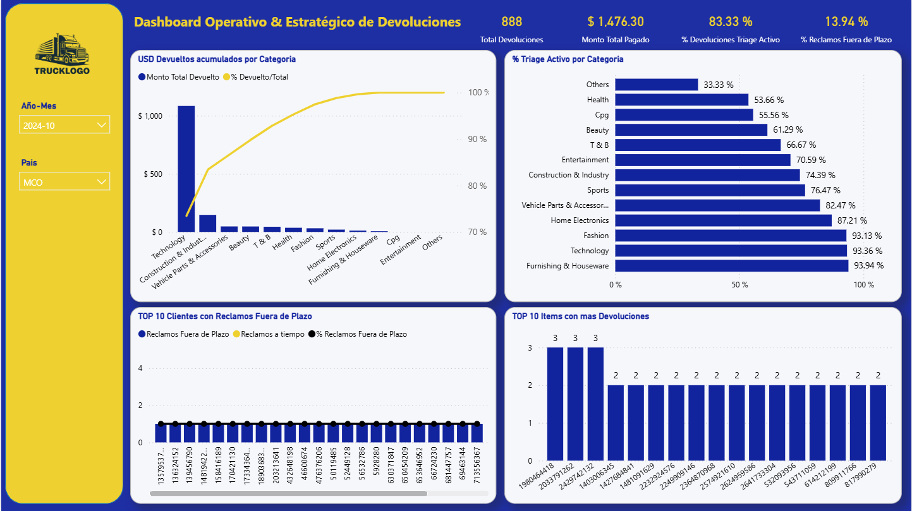

# Dashboard de Gestión de Devoluciones
### Análisis Operativo y Estratégico — E-commerce


## Descripción

Análisis integral del comportamiento de devoluciones para una empresa líder de e-commerce 
en Latinoamérica. El proyecto fue desarrollado como business case resolviendo preguntas 
reales de negocio mediante SQL y Power BI, con foco en la toma de decisiones operativas 
y estratégicas.

**[▶ Ver Dashboard](https://app.powerbi.com/view?r=eyJrIjoiYWNmZDc5NmYtYWZjNi00NzA0LTk4ZTUtODlkYzBkZjI2N2Q3IiwidCI6ImFmMjUxN2FmLTFkZjAtNDEwMy1iMzM4LTQxMWQwYjE5ZWI4NSJ9)**

---

## Preguntas de negocio respondidas

- ¿Cuál es el volumen y valor económico de devoluciones por país?
- ¿Qué impacto tendría modificar el plazo permitido para que un seller realice un reclamo?
- ¿Qué categorías de productos deben priorizarse para revisión (triage)?
- ¿Qué sellers concentran la mayor cantidad de reclamos fuera de plazo?
- ¿Qué ítems presentan mayor frecuencia de devoluciones?

---

## Contexto del análisis

Las devoluciones representan uno de los mayores desafíos operativos y financieros en 
e-commerce. Este análisis busca identificar patrones de riesgo, dimensionar el impacto 
económico real y generar indicadores accionables para la gestión de devoluciones, 
reclamos y priorización de triage.

---

## Métricas utilizadas

| Métrica | Descripción | Uso |
|---------|-------------|-----|
| GMV_USD | Valor comercial total de los productos devueltos | Exposición económica teórica |
| PAGO_BPP_USD | Monto efectivamente pagado por la devolución | Impacto financiero real |

La distinción entre ambas métricas fue una decisión analítica clave: GMV mide la 
exposición potencial mientras que PAGO_BPP mide el costo directo efectivo.

---

## Análisis realizados

### 1 — Comportamiento de devoluciones por país
Volumen de devoluciones y valor total de mercadería devuelta por país, para identificar 
mercados con mayor exposición operativa y económica.

### 2 — Impacto de modificar el plazo de reclamo
Evaluación del impacto de acortar o alargar el plazo de 3 días que tienen los sellers 
para reclamar una devolución. Se identificaron reclamos fuera de plazo y su monto total 
pagado por país.

### 3 — Categorías prioritarias para Triage
Identificación de categorías con mayor volumen de devoluciones y exposición económica, 
cruzado con el estado actual de triage activo por categoría. Permite enfocar recursos 
operativos en las categorías de mayor riesgo.

---

## Scripts SQL

| Script | Descripción |
|--------|-------------|
| Devoluciones por país | Volumen y GMV agrupado por país |
| Reclamos fuera de plazo | Filtro por CASE_DATE > 3 días desde DT_SHP_STATUS_FINAL |
| Categorías para triage | JOIN con tabla de categorías y estado de triage |
| Reclamos fuera de plazo por seller | Ranking de sellers con mayor incumplimiento |
| GMV por categoría y seller | Exposición económica por seller y categoría |
| Frecuencia de devoluciones por ítem | Detección de ítems problemáticos |
| Reclamos fuera de plazo por seller y mes | Monitoreo mensual de patrones de riesgo |

---

## Dashboard

El dashboard integra una vista operativa y una vista estratégica con los siguientes 
indicadores principales:

- Total de devoluciones
- Monto total pagado (USD)
- % de devoluciones con triage activo
- % de reclamos fuera de plazo
- USD devueltos acumulados por categoría
- % de triage activo por categoría
- Top 10 sellers con reclamos fuera de plazo
- Top 10 ítems con más devoluciones



---

## Decisiones analíticas destacadas

- Se excluyeron reclamos sin CASE_DATE por no ser gestionables, garantizando 
  consistencia en los indicadores de plazo
- Se diferenciaron GMV y PAGO_BPP para separar exposición económica teórica 
  de impacto financiero real
- Se utilizó LEFT JOIN con la tabla de triage para mantener categorías sin estado 
  asignado y evitar pérdida de información

---

## Tecnologías utilizadas

- **SQL Server** — extracción, transformación y generación de indicadores
- **Power BI Desktop** — modelado y visualización
- **Power BI Service** — publicación y acceso web

---

## Estructura del repositorio
```
proyecto-02-dashboard-devoluciones/
│
├── README.md
├── sql/
│   └── consultas_devoluciones.sql
├── docs/
│   └── documentacion_analisis.pdf
├── presentacion/
│   └── analisis_devoluciones_triage.pptx
├── pbix/
│   └── dashboard_devoluciones.pbix
└── assets/
    ├── dashboard-captura-1.png
    
```

---

## Sobre este proyecto

Business case desarrollado para un proceso de selección en una empresa líder de 
e-commerce en Latinoamérica. El análisis, los scripts SQL, el dashboard y la 
documentación son de autoría propia.

[LinkedIn](https://linkedin.com/in/juan-pablo-grossi) · [GitHub](https://github.com/jpgrossi)
